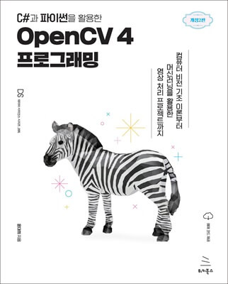

# C#과 파이썬을 활용한 OpenCV 4 프로그래밍 (개정2판)

## Notice

각각의 예제는 실행 환경 및 라이브러리/프레임워크 버전에 따라 결과가 다를 수 있습니다. 이 책에서 사용한 OpenCV 버전은 4.8.0입니다.

OpenCV의 안정적인(stable) 버전이 변경될 수 있으므로, 이 책에서 사용한 버전 설치가 불가능할 수 있습니다.

이런 경우 책에서 사용한 버전과 유사한 버전으로 설치합니다.

이 책에서 사용된 데이터는 각 예제의 경로마다 포함돼 있지만, 모델 파일은 해당 경로에 포함되어 있지 않습니다.

그러므로 딥러닝 관련 모델 파일 또는 데이터세트 파일을 압축을 해제한 후, 올바른 경로로 이동해야 합니다.

## Datasets

이 책에서 사용된 데이터세트는 크게 다음과 같습니다.

- `images`: 이미지 파일 모음
- `video`: 비디오 파일 모음
- `models`: 모델 및 학습 데이터 세트 모음
  - 압축 해제 후, 경로 이동 필요

## Contacts

- 윤대희 : s076923@gamil.com